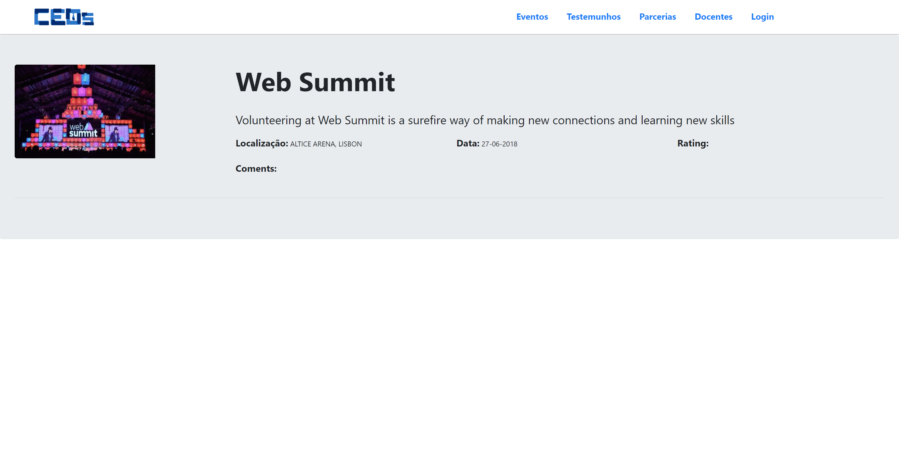
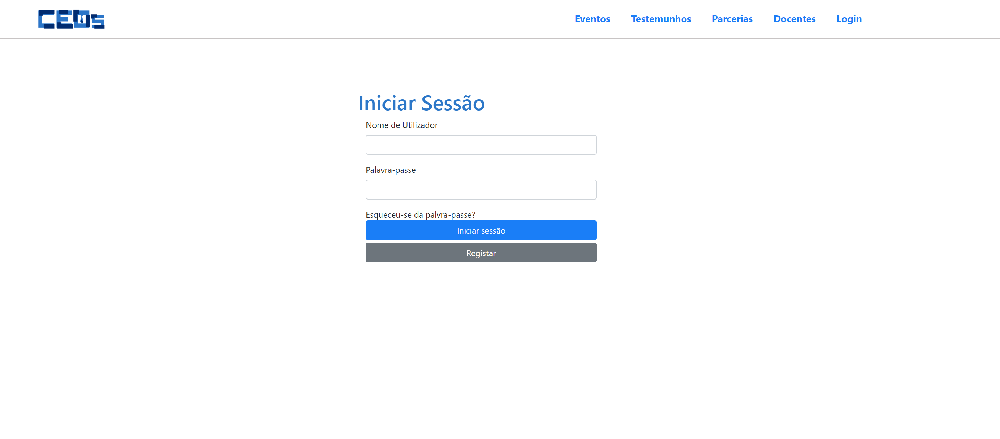

# CEOs projet

## About

CEOs is an acronym for Check Events Online and Share
This was a project for the first year of university in a Web technologies and information systems.
For both of us, it was the first experience in creating an website with html, css and javascript.

The CE0s is a website where you can check events on a catalog, filter for keywords and other parameters, create an account and register for events. You can also check partnerships and testimonies.

## Interface

### Homepage

### Event page

### Loginpage

#### Authors

* **Eloi Leitão** - [eloileitao](https://github.com/eloileitao)

* **Rodrigo Queirós** - [RodrigoQueiros](https://github.com/RodrigoQueiros)
